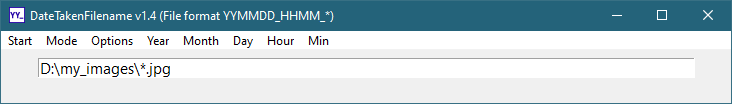
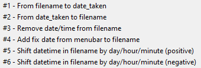
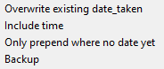

## DateTakenFilename 

Set date taken of images from filename or vice versa 

### Start

**Using python**  
For all required packages listed in the header of **DateTakenFilename.py**, check if they are installed in your python distribution (`python -m pip show <package>`) and install if not (`python -m pip install <package>`). If all requirements are installed, execute `python DateTakenFilename.py`. 

**Executable for windows users**  
For windows users, a ZIP-file with a compiled program is available under Releases. Download, unzip and execute **DateTakenFilename.exe**.

### Settings

**Modes**  

`tbd`

**Options**  

`tbd`

